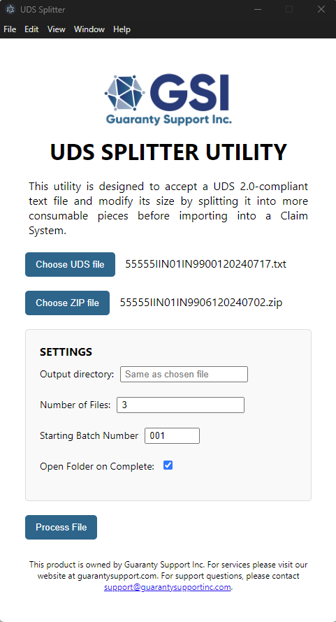

# UDS Splitter Utility 
Welcome! This is the source code repository for the UDS Splitter desktop utility. Please observe our [LICENSE](LICENSE)
and also make note of the features completed or pending below! The reason for this project is some Guaranty Associations
have had difficulty loading larger Uniform Data Standard 2.0 (UDS) files into their Claim System. This difficulty is
largely because of unoptimized validation pipelines or in-memory data processing from lower versions of programming
languages like Visual Basic. Another issue is UDS 2.0 files cannot be easily split into their individual parts since
some systems rely on the HEADER and TRAILER rows to validate data before importing it which means that manually modifying
UDS records also depends on users knowing how to fix the HEADER and TRAILER for each record type. This software aims to
solve this problem by making the split process easy while still making the new files UDS compatible.

| Status             | Icon          |
|--------------------|---------------|
| :white_check_mark: | Completed     |
| :pencil2:          | In Progress   |
| :x:                | Not completed |

| Stage              | Meaning                                                   |
|--------------------|-----------------------------------------------------------|
| Implementation     | Code is written in this stage                             |
| Unit Testing       | Code is tested for reliability and flexibility            |
| 3rd-Party Verified | Another party outside GSI has confirmed the feature works |

| Feature                                        | Implementation     | Unit Testing       | 3rd-Party Verified |
|------------------------------------------------|--------------------|--------------------|--------------------|
| Split A Record                                 | :white_check_mark: | :white_check_mark: | :x:                |
| Split F Record                                 | :white_check_mark: | :white_check_mark: | :x:                |
| Split G Record                                 | :white_check_mark: | :white_check_mark: | :x:                |
| Split I Record                                 | :white_check_mark: | :white_check_mark: | :x:                |
| Split M Record                                 | :x:                | :x:                | :x:                |
| Split B Record                                 | :white_check_mark: | :white_check_mark: | :x:                |
| Split C Record                                 | :x:                | :x:                | :x:                |
| Split D Record                                 | :x:                | :x:                | :x:                |
| Keep claims together during split              | :white_check_mark: | :white_check_mark: | :x:                |
| Logging to file                                | :x:                | :x:                | :x:                |
| GitHub Checks integration for /dev and /master | :white_check_mark: | :x:                | :x:                |
| Windows Code Signing Certificate               | :x:                | :x:                | :x:                |
| Apple Code Signing Certificate                 | :x:                | :x:                | :x:                |
| Automatic Record Type Detection                | :white_check_mark: | :white_check_mark: | :x:                |
| Progress Bar                                   | :white_check_mark: | :white_check_mark: | :x:                |
| Open Folder on Complete                        | :white_check_mark: | :white_check_mark: | :x:                |
| Ability to save settings                       | :x:                | :x:                | :x:                |
| 'Help' links in menubar                        | :white_check_mark: | :white_check_mark: | :x:                |
| Downloadable installation executable           | :x:                | :x:                | :x:                |
| User Manual                                    | :white_check_mark: | :white_check_mark: | :x:                |

## Notes from the team (August 2nd, 2024)
We are currently in the process of getting automated unit testing in place for A/F/G/M/B. I Records are in progress
still mainly due to the ZIP file companion which needs special attention. Our focus has been on the bare minimum use-case
that would be immediately helpful with priorities provided by a member from North Carolina (A/F/I/B).

Some low-hanging fruit will be tackled early next week while automated testing progresses, but the first milestone is
to get 3rd-Party Verification for a few of the above features.
